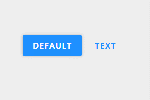

<div align="center">

  # Google material button example
  순수 JavsScript와 CSS로 구현된 구글 머티리얼 버튼 예제

  

</div>

<hr>

# How to use

- HTML

```html
<!-- Import style / script -->
<link rel="stylesheet" href="index.css">
<script src="index.js"></script>

<button id="btn-1" class="btn blue-default">Default</button>
<button id="btn-2" class="btn blue-text">Text</button>
```

- Javascript

```javascript
document.addEventListener('DOMContentLoaded', function () {
  const e1 = document.getElementById('btn-1')
  const e2 = document.getElementById('btn-2')

  $material.button(e1)
  $material.button(e2)
})
```

# 정보
- 개발자: Leegeunhyeok
- 라이선스: MIT
